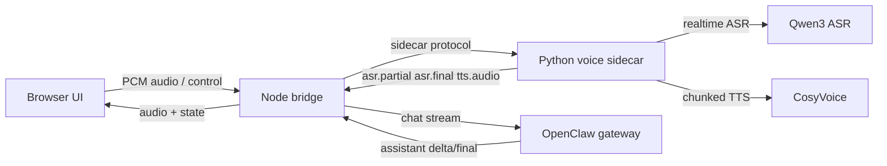

# Claw-Xtalk

OpenClaw x X-Talk alpha demo for full-duplex browser voice interaction.

This repository wires four pieces into one end-to-end voice loop:

- a browser voice UI for microphone capture and audio playback
- a Node.js bridge that owns turn orchestration and OpenClaw integration
- a Python sidecar that proxies ASR and TTS providers
- an OpenClaw gateway session that remains the single agent authority

The current alpha focuses on a usable demo loop rather than product packaging:

- streaming ASR with partial and final transcripts
- streaming agent output from OpenClaw
- sentence-chunked TTS playback
- full-duplex barge-in during assistant speech
- multi-turn conversation continuity
- browser-side local VAD segmentation to reduce noise-triggered turns
- filler/noise transcript suppression for low-value ASR fragments
- **Fast Enhancer (sherpa-onnx GTCRN) noise denoiser** on the realtime mic path
  to stop background noise from falsely interrupting the AI mid-sentence

## Status

This codebase is at demo alpha quality.

What is already working:

- browser-to-agent-to-speech closed loop
- OpenClaw session reuse across multiple turns
- DashScope Qwen realtime ASR integration
- DashScope CosyVoice TTS integration
- optional local CosyVoice fallback path
- interrupt and playback-stop handling

What is intentionally still rough:

- browser UI is functional, not polished product UI
- deployment is local-process based, not packaged yet
- noise robustness is improved but still demo-grade
- no automated end-to-end test suite yet

## Architecture



Design rules:

- OpenClaw remains the only agent and session authority.
- The Python sidecar owns speech-provider integration.
- The Node bridge owns turn state, interruption, and text chunking.
- The browser never talks to cloud ASR/TTS APIs directly.

## Repository Layout

- `docs/`
  architecture notes and official API integration design
- `openclaw-extension-xtalk/`
  Node.js bridge service and browser UI
  - `src/adapters/` provider-facing bridge adapters
  - `src/bridge/` turn orchestration, interruption, and session mapping
  - `src/web/` HTTP routes and in-browser voice UI
  - `package.json` build and runtime entrypoints
- `xtalk-bridge-service/`
  Python speech sidecar
  - `app.py` sidecar entrypoint
  - `websocket_server.py` bridge protocol server
  - `xtalk_runtime.py` ASR and TTS runtime implementations
  - `config/config.py` runtime configuration loading
  - `scripts/bootstrap_cosyvoice.py` optional local CosyVoice bootstrap helper
  - `scripts/bootstrap_fast_enhancer.py` downloads the Fast Enhancer (GTCRN) denoiser model
  - `reference-audio/` local reference material placeholder

## Main Components

### `openclaw-extension-xtalk`

Standalone Node.js bridge process.

Responsibilities:

- host the browser UI at `http://127.0.0.1:7430/ui`
- maintain browser session, speech session, and OpenClaw session mapping
- forward ASR results into OpenClaw
- stream assistant deltas back into TTS chunking
- handle interruption, cancellation, and new-turn rotation

Key modules:

- `src/bridge/turn-orchestrator.ts`
- `src/bridge/session-registry.ts`
- `src/bridge/interrupt-controller.ts`
- `src/adapters/openclaw-agent-adapter.ts`
- `src/adapters/xtalk-adapter.ts`
- `src/web/routes.ts`

### `xtalk-bridge-service`

Python speech sidecar.

Responsibilities:

- accept browser audio relayed by the bridge
- maintain one ASR session per active turn
- proxy realtime ASR events back to the bridge
- serialize TTS requests and stream generated audio chunks back
- translate provider-specific behavior into the project protocol

Supported provider modes:

- `ASR_PROVIDER=qwen-realtime` for DashScope Qwen realtime ASR (cloud)
- `ASR_PROVIDER=qwen-local` for local **Qwen3-ASR-0.6B** streaming (no API key)
- `ASR_PROVIDER=whisper` for local fallback ASR
- `TTS_PROVIDER=aliyun-cosyvoice` for DashScope CosyVoice
- `TTS_PROVIDER=cosyvoice` for local CosyVoice fallback
- `TTS_PROVIDER=omnivoice` for local OmniVoice (high-performance diffusion model, no API key needed)
- **Fast Enhancer** (sherpa-onnx GTCRN, `SPEECH_ENHANCER_ENABLED=1`) — optional
  realtime speech-denoiser front-end shared by every ASR provider

## Runtime Requirements

Recommended environment:

- Linux
- Node.js 20+
- Python 3.10+
- an OpenClaw gateway available locally
- valid local OpenClaw device identity under `~/.openclaw/identity`
- DashScope API key if using cloud ASR/TTS

Expected local ports:

- `7430` browser UI and bridge HTTP server
- `7431` Python sidecar WebSocket server
- `18789` OpenClaw gateway WebSocket endpoint

## Quick Start

The fastest path is the one-click launcher (recommended). Skip to
[One-click launcher](#one-click-launcher-recommended) if you want
everything brought up automatically.

### One-click launcher (recommended)

```bash
cp xtalk-bridge-service/.env.example xtalk-bridge-service/.env
# (optional) edit .env if you want to add DASHSCOPE_API_KEY for cloud TTS
./scripts/start-all.sh
```

The launcher is fully self-contained and idempotent. On first run it will:

1. Auto-install [`uv`](https://docs.astral.sh/uv/) if it is not on `PATH`
   (via `curl -LsSf https://astral.sh/uv/install.sh | sh`).
2. Create two isolated virtual environments:
   - `./.venv` — sidecar + omnivoice (transformers >= 5.3)
   - `./.venv-qwen-asr` — local Qwen3-ASR server (transformers == 4.57.6)
   (the two transformers pins are incompatible, so they must live in
   separate venvs and talk over an OpenAI-compatible HTTP API).
3. Detect NVIDIA GPU and install `qwen-asr[vllm]` if available, otherwise
   fall back to bare `qwen-asr` (transformers backend, slower).
4. Download the Qwen3-ASR model into
   `xtalk-bridge-service/pretrained_models/Qwen3-ASR-0.6B`.
5. Start `qwen-asr-serve` on `127.0.0.1:8910`, the Python sidecar on
   `127.0.0.1:7431`, and the Node bridge on `127.0.0.1:7430`.
6. Tear everything down cleanly on `Ctrl-C`.

Useful flags:

```bash
./scripts/start-all.sh --no-asr        # skip local ASR (fall back to cloud / .env)
./scripts/start-all.sh --no-node       # skip the Node bridge
./scripts/start-all.sh --no-sidecar    # skip the Python sidecar
./scripts/start-all.sh --reinstall     # nuke and rebuild both venvs
./scripts/start-all.sh --help
```

Useful env overrides:

| Variable | Default | Purpose |
| --- | --- | --- |
| `SIDECAR_VENV` | `./.venv` | Path to the sidecar virtual environment |
| `ASR_VENV` | `./.venv-qwen-asr` | Path to the qwen-asr virtual environment |
| `QWEN_LOCAL_MODEL` | `Qwen/Qwen3-ASR-0.6B` | Model id / local dir |
| `QWEN_ASR_SERVE_HOST` | `127.0.0.1` | Bind host for `qwen-asr-serve` |
| `QWEN_ASR_SERVE_PORT` | `8910` | Bind port for `qwen-asr-serve` |
| `QWEN_ASR_SERVE_GPU_MEM_UTIL` | `0.40` | vLLM `--gpu-memory-utilization`. **Cap**, not target — keeps ASR inside ~40% of the GPU so a TTS engine can coexist. Raise to `0.85` if you only run ASR. |
| `QWEN_ASR_SERVE_MAX_MODEL_LEN` | `2048` | vLLM `--max-model-len`. Model default is 65536 (~7 GiB KV); ASR turns are short (< 30 s audio) so 2048 tokens is plenty. |
| `QWEN_ASR_SERVE_MAX_NUM_SEQS` | `1` | vLLM `--max-num-seqs`. Single-stream ASR — no need to reserve KV slots for the default 256 concurrent requests. |
| `QWEN_ASR_SERVE_ENFORCE_EAGER` | `1` | When non-zero, passes `--enforce-eager` to skip CUDA-graph capture (saves 1–3 GiB). |
| `QWEN_ASR_SERVE_KV_CACHE_DTYPE` | `fp8` | vLLM `--kv-cache-dtype`. `fp8` halves KV memory with negligible WER impact; set to `auto` on GPUs without FP8 support (Pascal/Volta). |
| `QWEN_ASR_SERVE_SWAP_SPACE` | `0` | vLLM `--swap-space` (GiB). `0` disables CPU paging reservation. |
| `QWEN_ASR_SERVE_EXTRA_ARGS` | *(empty)* | Extra args appended to `qwen-asr-serve`. If you pass any of the flags above here directly, the launcher will skip its own version of that flag so your value wins. |

Logs are written to `./logs/` (`qwen-asr-serve.log`, `xtalk-sidecar.log`,
`openclaw-bridge.log`, plus install logs). PIDs are tracked in `./.run/`.

If the launcher detects an existing healthy `qwen-asr-serve` on the configured
port (`/v1/models` responds 200), it reuses it instead of starting a new one.

> **Why `uv`?** The launcher uses `uv` instead of the system `python -m venv`
> because some Linux distros ship Python without `ensurepip` /
> `python3-venv`, which silently produces broken virtual environments. `uv`
> bypasses that entirely and is also much faster. If the script fails to
> auto-install `uv`, install it manually and rerun:
>
> ```bash
> curl -LsSf https://astral.sh/uv/install.sh | sh
> exec $SHELL -l
> ./scripts/start-all.sh
> ```

#### Sharing the GPU with TTS

The defaults above are tuned to leave headroom for a TTS model
(`omnivoice` ≈ 3 GiB, `cosyvoice2` ≈ 4 GiB) on the same card. Rough budget on
an 8 GiB GPU:

| Slot | Approx. VRAM |
| --- | --- |
| Qwen3-ASR-0.6B weights (bf16) | ~1.3 GiB |
| KV cache (`max-model-len=2048`, fp8, 1 seq) | ~0.3 GiB |
| vLLM activations / overhead (eager, no CUDA graphs) | ~0.6 GiB |
| **ASR total cap** (`gpu-memory-utilization=0.40`) | **~3.2 GiB** |
| Free for TTS + framework | ~4.5 GiB |

Suggested overrides for other GPU sizes:

```bash
# 6 GiB GPU, ASR-only (no TTS coexistence needed):
QWEN_ASR_SERVE_GPU_MEM_UTIL=0.85 ./scripts/start-all.sh

# 12 GiB GPU, give ASR more KV headroom for longer turns:
QWEN_ASR_SERVE_GPU_MEM_UTIL=0.50 \
QWEN_ASR_SERVE_MAX_MODEL_LEN=4096 \
  ./scripts/start-all.sh

# Ultra-tight (4 GiB) — drop FP8 if your GPU is pre-Ada/Hopper and use
# the transformers backend instead by switching QWEN_LOCAL_BACKEND=transformers
# in the sidecar .env (slower, no streaming, but ~1.5 GiB total).
```

### Manual setup

If you prefer to run each component yourself, follow steps 1–7 below.

### 1. Install bridge dependencies

```bash
cd openclaw-extension-xtalk
npm install
```

### 2. Create a Python environment for the sidecar

Using `uv` (recommended):

```bash
curl -LsSf https://astral.sh/uv/install.sh | sh   # if not installed
uv venv .venv
uv pip install --python .venv/bin/python -r xtalk-bridge-service/requirements.txt
source .venv/bin/activate
```

Using conda:

```bash
conda create -n claw-xtalk python=3.10 -y
conda activate claw-xtalk
cd xtalk-bridge-service
pip install -r requirements.txt
```

Using stock venv (requires `python3-venv` on Debian/Ubuntu):

```bash
sudo apt-get install -y python3.12-venv python3.12-dev   # if missing
python3 -m venv .venv
source .venv/bin/activate
cd xtalk-bridge-service
pip install -r requirements.txt
```

> Note: `omnivoice` and `qwen-asr` are **commented out** in
> `requirements.txt` because their `transformers` version pins conflict.
> If you want local Qwen3-ASR, see
> [Optional Local Qwen3-ASR Mode](#optional-local-qwen3-asr-mode) below or
> just use the one-click launcher.

### 3. Configure environment variables

Copy the example file:

```bash
cp xtalk-bridge-service/.env.example xtalk-bridge-service/.env
```

Then fill in at least:

- `DASHSCOPE_API_KEY`
- `ASR_PROVIDER`
- `TTS_PROVIDER`
- `ALIYUN_COSYVOICE_MODEL`
- `ALIYUN_COSYVOICE_VOICE`

For the current demo, the most reliable cloud smoke-test combination is:

- `ASR_PROVIDER=qwen-realtime`
- `QWEN_ASR_MODEL=qwen3-asr-flash-realtime`
- `TTS_PROVIDER=aliyun-cosyvoice`
- `ALIYUN_COSYVOICE_MODEL=cosyvoice-v3-flash`
- `ALIYUN_COSYVOICE_VOICE=longanyang`

For a fully local, no-API-key setup using OmniVoice TTS:

- `ASR_PROVIDER=whisper`
- `TTS_PROVIDER=omnivoice`
- `OMNIVOICE_DEVICE=cuda:0`

Note:

- `cosyvoice-v3.5-flash` does not provide built-in system voices.
- For `cosyvoice-v3.5-flash`, `ALIYUN_COSYVOICE_VOICE` must be a valid clone/design voice ID.

### 4. Make sure OpenClaw is available

The bridge expects an OpenClaw gateway at:

```text
ws://127.0.0.1:18789
```

If your gateway runs elsewhere, set:

```bash
export OPENCLAW_GATEWAY_URL=ws://host:port
```

The bridge also expects authenticated local device identity files under:

```text
~/.openclaw/identity/
```

### 5. Start the Python sidecar

```bash
cd xtalk-bridge-service
python app.py
```

You should see logs similar to:

```text
X-Talk Bridge Service starting up
Configuring Qwen Realtime ASR ...
Configuring DashScope CosyVoice TTS ...
X-Talk sidecar listening on ws://127.0.0.1:7431
```

### 6. Build and start the Node bridge

```bash
cd openclaw-extension-xtalk
npm install
npm run build
npm start
```

You should see logs similar to:

```text
Bridge server listening on http://127.0.0.1:7430
Browser UI: http://127.0.0.1:7430/ui
XtalkAdapter connected
OpenclawAgentAdapter connected
```

### 7. Open the browser UI

Open:

```text
http://127.0.0.1:7430/ui
```

Then:

1. allow microphone access
2. start recording
3. speak normally
4. interrupt the assistant while it is talking to test barge-in

## Optional Local Qwen3-ASR Mode

Local Qwen3-ASR-0.6B streaming runs entirely on your machine — no DashScope key,
no cloud round-trip. The one-click launcher (above) sets this up for you;
this section documents the moving parts for manual configuration and debugging.

### Why a separate process?

`omnivoice` (TTS) requires `transformers >= 5.3.0` and `qwen-asr` pins
`transformers == 4.57.6`. They cannot share one virtual environment. The
project solves this by running `qwen-asr-serve` in its own venv
(`./.venv-qwen-asr`) and having the sidecar talk to it over the
OpenAI-compatible HTTP API:

```text
[browser PCM] -> [sidecar (./.venv)] --HTTP /v1/audio/transcriptions--> [qwen-asr-serve (./.venv-qwen-asr)]
```

The sidecar exposes three backends via `QWEN_LOCAL_BACKEND`:

| Backend | Use when | Pros | Cons |
| --- | --- | --- | --- |
| `vllm` | Local ASR only, no `omnivoice` | Lowest latency, single process | Conflicts with `omnivoice` |
| `transformers` | Local ASR only, no `omnivoice` | Pure-python, no vLLM build | Slower |
| `openai` | You also need `omnivoice` (split-process) | Both engines coexist | Adds an HTTP hop |

The launcher picks `openai` automatically.

### Manual setup (without the launcher)

```bash
# 1) Sidecar venv (omnivoice / DashScope / etc.)
uv venv .venv
uv pip install --python .venv/bin/python -r xtalk-bridge-service/requirements.txt

# 2) Dedicated qwen-asr venv
uv venv .venv-qwen-asr
uv pip install --python .venv-qwen-asr/bin/python -U "qwen-asr[vllm]"   # or "qwen-asr" on CPU

# 3) Pre-fetch the model (optional; qwen-asr-serve will download on demand)
./.venv/bin/python xtalk-bridge-service/scripts/bootstrap_qwen3_asr.py \
  --model Qwen/Qwen3-ASR-0.6B \
  --target xtalk-bridge-service/pretrained_models/Qwen3-ASR-0.6B

# 4) Launch the local ASR server (terminal A)
./.venv-qwen-asr/bin/qwen-asr-serve Qwen/Qwen3-ASR-0.6B \
  --host 127.0.0.1 --port 8910 --gpu-memory-utilization 0.5

# 5) Point the sidecar at it (terminal B)
export ASR_PROVIDER=qwen-local
export QWEN_LOCAL_BACKEND=openai
export QWEN_LOCAL_OPENAI_BASE_URL=http://127.0.0.1:8910/v1
./.venv/bin/python xtalk-bridge-service/app.py
```

### Hardware

| Mode | Min VRAM | Recommended GPU |
| --- | --- | --- |
| `vllm` backend | 4 GB | RTX 3060+ |
| `transformers` backend | 3 GB | RTX 2060+ |
| CPU only | — | not recommended for real-time |

### Configuration

All variables live under the `QWEN_LOCAL_*` prefix in
`xtalk-bridge-service/.env` (see `.env.example` for the full block):

| Variable | Default | Purpose |
| --- | --- | --- |
| `QWEN_LOCAL_MODEL` | `Qwen/Qwen3-ASR-0.6B` | Model id or local dir |
| `QWEN_LOCAL_BACKEND` | `vllm` | `vllm`, `transformers`, or `openai` |
| `QWEN_LOCAL_DEVICE` | `cuda:0` | Torch device (transformers backend) |
| `QWEN_LOCAL_DTYPE` | `bfloat16` | `bfloat16`, `float16`, or `float32` |
| `QWEN_LOCAL_LANGUAGE` | `zh` | Recognition language hint |
| `QWEN_LOCAL_GPU_MEM_UTIL` | `0.5` | vLLM `gpu_memory_utilization` |
| `QWEN_LOCAL_MAX_NEW_TOKENS` | `64` | Per-chunk generation cap |
| `QWEN_LOCAL_STREAMING_CHUNK_MS` | `480` | Audio chunk size fed to the model |
| `QWEN_LOCAL_UNFIXED_CHUNK_NUM` | `2` | Streaming-state lookahead chunks |
| `QWEN_LOCAL_UNFIXED_TOKEN_NUM` | `5` | Streaming-state lookahead tokens |
| `QWEN_LOCAL_CHUNK_SIZE_SEC` | `2.0` | Internal chunking window (seconds) |
| `QWEN_LOCAL_PARTIAL_MIN_INTERVAL_MS` | `200` | Throttle for partial events |
| `QWEN_LOCAL_ENERGY_THRESHOLD` | `200` | Front-end VAD energy gate |
| `QWEN_LOCAL_SILENCE_LIMIT_MS` | `600` | Silence to trigger finalize |
| `QWEN_LOCAL_MIN_SPEECH_MS` | `200` | Minimum speech to emit a turn |
| `QWEN_LOCAL_OPENAI_BASE_URL` | `http://127.0.0.1:8910/v1` | HTTP endpoint for `openai` backend |
| `QWEN_LOCAL_OPENAI_API_KEY` | `EMPTY` | API key forwarded to `qwen-asr-serve` |
| `QWEN_LOCAL_OPENAI_TIMEOUT_S` | `30.0` | Request timeout for `openai` backend |

## Optional Local CosyVoice Mode

If you want local TTS instead of DashScope:

```bash
cd xtalk-bridge-service
python scripts/bootstrap_cosyvoice.py --install-deps
```

Then switch your `.env` to:

```text
TTS_PROVIDER=cosyvoice
TTS_MODE=zero_shot
```

You may also need to set:

- `COSYVOICE_REPO_DIR`
- `TTS_MODEL_DIR`
- `TTS_PROMPT_WAV`
- `TTS_PROMPT_TEXT`

Notes:

- local CosyVoice is heavier and more environment-sensitive than the cloud path
- cloud mode is the recommended default for demo and GitHub onboarding

## Optional Local OmniVoice Mode

OmniVoice is a locally-running diffusion-language TTS model with no cloud dependency.
It delivers competitive latency on a consumer GPU (RTX 3060 or better) and supports
voice cloning, voice design, and auto-voice modes.

### Hardware requirements

| Component | Minimum | Recommended |
| --- | --- | --- |
| GPU VRAM | 6 GB (with `float16`) | 8+ GB |
| GPU | RTX 2080 / A10 | RTX 3090 / 4090 |
| CUDA | 11.8+ | 12.x |
| Python | 3.10 | 3.10–3.12 |

CPU-only mode works but is much slower and not suitable for real-time conversation.

### Install the Python package

```bash
pip install omnivoice
```

### First-run model download

On the first start the sidecar will download the model weights (~3 GB) from
HuggingFace automatically when `OMNIVOICE_MODEL_DIR` does not yet exist.

China users: set the HuggingFace mirror before starting:

```bash
export HF_ENDPOINT=https://hf-mirror.com
```

Or pre-download manually and point `OMNIVOICE_MODEL_DIR` at the local copy:

```bash
huggingface-cli download k2-fsa/OmniVoice --local-dir ./pretrained_models/OmniVoice
```

### Activate in `.env`

```text
TTS_PROVIDER=omnivoice
OMNIVOICE_DEVICE=cuda:0
OMNIVOICE_DTYPE=float16
OMNIVOICE_NUM_STEP=8
```

### Voice modes

**Auto voice** (simplest — no extra config needed):

```text
# leave REF_AUDIO, REF_TEXT, OMNIVOICE_INSTRUCT all empty
```

**Voice design** (no reference recording required):

```text
OMNIVOICE_INSTRUCT=female, low pitch
```

Other example values: `"male, energetic, fast"`, `"warm, elderly female"`.

**Voice cloning** (best quality, requires a 3–10 second reference clip):

```text
OMNIVOICE_REF_AUDIO=./reference-audio/my_voice.wav
OMNIVOICE_REF_TEXT=这是我用来克隆声音的参考句子。
```

Setting `OMNIVOICE_REF_TEXT` lets OmniVoice skip its built-in Whisper ASR transcription,
saving approximately 500 MB of VRAM and several seconds of startup time.

### Latency benchmark (warm GPU, `NUM_STEP=8`)

The following log was captured on a typical run with the default pipeline settings:

```text
[OmniVoice] chars=26  ttfa=1180 ms  dur=6.20 s  RTF=0.190
[OmniVoice] chars=32  ttfa=1448 ms  dur=12.96 s  RTF=0.112
[OmniVoice] chars=14  ttfa=1095 ms  dur=5.08 s  RTF=0.216
[OmniVoice] chars=10  ttfa=1036 ms  dur=2.88 s  RTF=0.360
[OmniVoice] chars=6   ttfa=970 ms   dur=2.08 s  RTF=0.466
```

`ttfa` is time-to-first-audio (synthesis latency). `RTF` below 1.0 means the audio is
generated faster than real time. The parallel synthesis pipeline introduced in this
project means the next sentence starts generating while the current one is still playing,
so the effective user-perceived gap between sentences approaches zero.

### Tuning tips

- **Latency vs quality**: `OMNIVOICE_NUM_STEP=8` is the recommended sweet-spot.
  Raising to 16 gives marginally better prosody at roughly 2× synthesis time.
  Do not exceed 32 in live conversation; the quality improvement is negligible.
- **Speed**: `OMNIVOICE_SPEED=1.1` to `1.2` can reduce overall response duration
  without sounding unnatural.
- **Guidance scale**: keep `OMNIVOICE_GUIDANCE_SCALE` at `2.0`; higher values can
  introduce artefacts on short utterances.

## Noise Robustness (Fast Enhancer)

Background noise — HVAC, keyboard typing, distant TV, and most importantly
the AI's own playback bleeding back through the mic — used to be the single
worst source of false barge-in: the AI would get cut off mid-sentence by
ambient sound. The bridge now ships a built-in **Fast Enhancer** front-end
that denoises every microphone chunk *before* it ever reaches ASR or the
barge-in detector.

Under the hood it is the [k2-fsa sherpa-onnx GTCRN](https://k2-fsa.github.io/sherpa/onnx/speech-enhancement/models.html#gtcrn-simple)
speech-denoiser model: < 1 MB on disk, single CPU thread, RTF ≈ 0.07
(roughly 3 ms of added latency per 60 ms audio chunk). After denoising,
stationary noise collapses toward zero RMS, which lets the existing
energy-gate in [`xtalk-bridge-service/websocket_server.py`](xtalk-bridge-service/websocket_server.py)
trivially reject it; partial transcripts produced from pure noise also stop,
so the ASR-partial gate (`SIDECAR_BARGE_IN_REQUIRE_ASR_PARTIAL`) becomes a
hard wall.

### Setup

The one-click launcher already installs `sherpa-onnx` from
`requirements.txt`. To download the model file (one-time, ~520 KB):

```bash
cd xtalk-bridge-service
python scripts/bootstrap_fast_enhancer.py
```

By default it lands at
`xtalk-bridge-service/pretrained_models/fast-enhancer/gtcrn_simple.onnx`,
which is exactly where `SPEECH_ENHANCER_MODEL` looks. The sidecar logs
`Fast Enhancer ready in N ms` on startup when it's wired in.

### Configuration

| Variable | Default | Purpose |
| --- | --- | --- |
| `SPEECH_ENHANCER_ENABLED` | `1` | Set to `0` to bypass denoising (useful for A/B tests) |
| `SPEECH_ENHANCER_MODEL` | `pretrained_models/fast-enhancer/gtcrn_simple.onnx` | Path to the GTCRN ONNX file |
| `SPEECH_ENHANCER_NUM_THREADS` | `1` | ONNX runtime intra-op threads |
| `SPEECH_ENHANCER_PROVIDER` | `cpu` | `cpu` (recommended), `cuda`, or `coreml` |

### Failure modes & how the bridge handles them

- **Model file missing** → sidecar logs a warning and runs without
  denoising; barge-in falls back to the previous heuristic-only behaviour.
- **`sherpa-onnx` not installed** → same as above.
- **Per-chunk inference exception** → that chunk is forwarded *raw*; the
  audio path never goes silent.

### Related barge-in tuning knobs (still respected)

If denoising alone is not enough for an unusually loud environment, the
existing post-denoise heuristics in `websocket_server.py` are still
configurable via env vars (all optional):

| Variable | Default | Purpose |
| --- | --- | --- |
| `SIDECAR_BARGE_IN_MIN_RMS` | `380` | Absolute RMS floor required to consider a chunk "voiced" |
| `SIDECAR_BARGE_IN_NOISE_MULTIPLIER` | `3.6` | Multiplier above the running noise floor |
| `SIDECAR_BARGE_IN_NOISE_MARGIN` | `180` | Additive margin above the noise floor |
| `SIDECAR_BARGE_IN_CONSECUTIVE_CHUNKS` | `6` | Voiced chunks required before firing |
| `SIDECAR_BARGE_IN_MIN_ACTIVE_MS` | `400` | Sustained-speech window required |
| `SIDECAR_BARGE_IN_REQUIRE_ASR_PARTIAL` | `1` | Require non-empty ASR partial before allowing barge-in |
| `SIDECAR_BARGE_IN_MIN_PARTIAL_CHARS` | `2` | Min characters in that partial to count as real speech |

## Configuration Reference

### Bridge process

Environment variables consumed by `openclaw-extension-xtalk`:

| Variable | Default | Purpose |
| --- | --- | --- |
| `BRIDGE_HTTP_PORT` | `7430` | HTTP port for browser UI and bridge server |
| `SIDECAR_WS_URL` | `ws://127.0.0.1:7431` | WebSocket address of the Python sidecar |
| `OPENCLAW_GATEWAY_URL` | `ws://127.0.0.1:18789` | OpenClaw gateway endpoint |

### Sidecar process

Configuration is loaded from `xtalk-bridge-service/.env` automatically on startup.

Important variables:

| Variable | Purpose |
| --- | --- |
| `DASHSCOPE_API_KEY` | DashScope credential for Qwen ASR and CosyVoice TTS |
| `ASR_PROVIDER` | `qwen-realtime`, `qwen-local`, or `whisper` |
| `QWEN_ASR_MODEL` | Recommended: `qwen3-asr-flash-realtime` |
| `QWEN_ASR_URL` | Realtime WebSocket endpoint |
| `QWEN_ASR_LANGUAGE` | Recognition language |
| `QWEN_ASR_SAMPLE_RATE` | Usually `16000` |
| `QWEN_ASR_TURN_DETECTION_THRESHOLD` | Server-side VAD sensitivity |
| `QWEN_ASR_TURN_DETECTION_SILENCE_MS` | Server-side endpoint silence window |
| `TTS_PROVIDER` | `aliyun-cosyvoice`, `cosyvoice`, or `omnivoice` |
| `ALIYUN_COSYVOICE_MODEL` | Cloud TTS model |
| `ALIYUN_COSYVOICE_VOICE` | Voice ID or system voice depending on model |
| `ALIYUN_COSYVOICE_AUDIO_FORMAT` | Output format, recommended WAV-compatible PCM |
| `ALIYUN_COSYVOICE_TIMEOUT_MS` | Timeout per TTS request |
| `OMNIVOICE_MODEL` | HuggingFace model ID (default `k2-fsa/OmniVoice`) |
| `OMNIVOICE_MODEL_DIR` | Local path; if it exists, loads from disk without network access |
| `OMNIVOICE_DEVICE` | `cuda:0` (default), `cpu`, or `mps` |
| `OMNIVOICE_DTYPE` | `float16` (CUDA) or `float32` (CPU/MPS) |
| `OMNIVOICE_NUM_STEP` | Diffusion steps — `8` for real-time, `16` for higher quality |
| `OMNIVOICE_GUIDANCE_SCALE` | CFG scale, `2.0` recommended |
| `OMNIVOICE_SPEED` | Speaking speed multiplier, `1.0` = natural |
| `OMNIVOICE_REF_AUDIO` | Path to 3–10 s reference WAV for voice cloning |
| `OMNIVOICE_REF_TEXT` | Transcript of `OMNIVOICE_REF_AUDIO` (skips built-in ASR) |
| `OMNIVOICE_INSTRUCT` | Voice-design attribute string, e.g. `"female, low pitch"` |
| `SPEECH_ENHANCER_ENABLED` | `1` to denoise mic audio with GTCRN before ASR / barge-in (default `1`) |
| `SPEECH_ENHANCER_MODEL` | Path to `gtcrn_simple.onnx` (default under `pretrained_models/fast-enhancer/`) |
| `SPEECH_ENHANCER_NUM_THREADS` | ONNX runtime threads, `1` is enough |
| `SPEECH_ENHANCER_PROVIDER` | `cpu` (recommended), `cuda`, or `coreml` |

## Turn Flow

High-level turn lifecycle:

1. browser captures microphone audio
2. local browser VAD decides when speech actually starts
3. Node bridge opens or refreshes the active turn
4. Python sidecar streams audio to ASR
5. ASR emits `partial` and `final` transcripts
6. bridge filters filler/noise transcripts
7. final user text is sent into the OpenClaw session
8. assistant deltas are chunked into sentence-sized TTS work items
9. sidecar synthesizes audio chunk by chunk
10. browser plays audio and supports user barge-in
11. on playback completion, the bridge rotates into a new turn automatically

## Current Demo Behaviors

Implemented behaviors worth knowing before debugging:

- assistant final text is not replayed twice
- normal playback completion creates a fresh new turn
- browser mic upload is segmented locally instead of raw continuous upload
- pure filler transcripts such as simple `嗯` fragments are suppressed before they hit the agent
- browser and sidecar both contribute to interruption detection

## Known Limitations

- very short but valid-looking fragments can still slip through ASR as low-information turns
- local VAD thresholds may need retuning across microphones and rooms
- this project currently assumes a local OpenClaw gateway with working device identity
- packaging, installer scripts, screenshots, and CI are not finalized yet

## Documents

Design documents in `docs/`:

- `docs/openclaw-xtalk-phase1-architecture.md`
- `docs/qwen3-asr-cosyvoice3-official-api-design.md`

Recommended reading order:

1. architecture doc
2. official API migration doc
3. this README for actual repository usage

## Roadmap After Alpha

- package the bridge as a proper OpenClaw extension artifact
- split provider adapters into cleaner modules
- add transcript quality metrics and better noise rejection
- add repeatable smoke tests for ASR and TTS
- support remote deployment of the speech sidecar
- expose Fast Enhancer through a streaming (per-frame) API once sherpa-onnx
  ships the Python binding for `OnlineSpeechDenoiser`

## License

Apache-2.0. See `LICENSE`.
