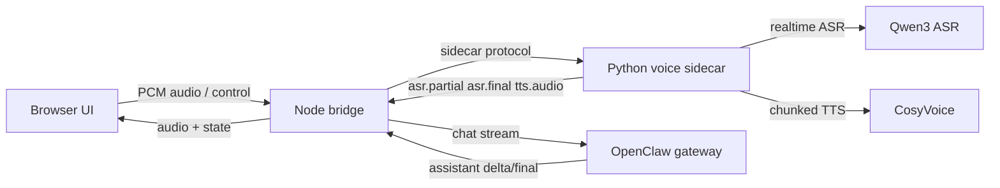

# Claw-Xtalk

OpenClaw x X-Talk alpha demo for full-duplex browser voice interaction.

This repository wires four pieces into one end-to-end voice loop:

- a browser voice UI for microphone capture and audio playback
- a Node.js bridge that owns turn orchestration and OpenClaw integration
- a Python sidecar that proxies ASR and TTS providers
- an OpenClaw gateway session that remains the single agent authority

The current alpha focuses on a usable demo loop rather than product packaging:

- streaming ASR with partial and final transcripts
- streaming agent output from OpenClaw
- sentence-chunked TTS playback
- full-duplex barge-in during assistant speech
- multi-turn conversation continuity
- browser-side local VAD segmentation to reduce noise-triggered turns
- filler/noise transcript suppression for low-value ASR fragments

## Status

This codebase is at demo alpha quality.

What is already working:

- browser-to-agent-to-speech closed loop
- OpenClaw session reuse across multiple turns
- DashScope Qwen realtime ASR integration
- DashScope CosyVoice TTS integration
- optional local CosyVoice fallback path
- interrupt and playback-stop handling

What is intentionally still rough:

- browser UI is functional, not polished product UI
- deployment is local-process based, not packaged yet
- noise robustness is improved but still demo-grade
- no automated end-to-end test suite yet

## Architecture



Design rules:

- OpenClaw remains the only agent and session authority.
- The Python sidecar owns speech-provider integration.
- The Node bridge owns turn state, interruption, and text chunking.
- The browser never talks to cloud ASR/TTS APIs directly.

## Repository Layout

- `docs/`
  architecture notes and official API integration design
- `openclaw-extension-xtalk/`
  Node.js bridge service and browser UI
  - `src/adapters/` provider-facing bridge adapters
  - `src/bridge/` turn orchestration, interruption, and session mapping
  - `src/web/` HTTP routes and in-browser voice UI
  - `package.json` build and runtime entrypoints
- `xtalk-bridge-service/`
  Python speech sidecar
  - `app.py` sidecar entrypoint
  - `websocket_server.py` bridge protocol server
  - `xtalk_runtime.py` ASR and TTS runtime implementations
  - `config/config.py` runtime configuration loading
  - `scripts/bootstrap_cosyvoice.py` optional local CosyVoice bootstrap helper
  - `reference-audio/` local reference material placeholder

## Main Components

### `openclaw-extension-xtalk`

Standalone Node.js bridge process.

Responsibilities:

- host the browser UI at `http://127.0.0.1:7430/ui`
- maintain browser session, speech session, and OpenClaw session mapping
- forward ASR results into OpenClaw
- stream assistant deltas back into TTS chunking
- handle interruption, cancellation, and new-turn rotation

Key modules:

- `src/bridge/turn-orchestrator.ts`
- `src/bridge/session-registry.ts`
- `src/bridge/interrupt-controller.ts`
- `src/adapters/openclaw-agent-adapter.ts`
- `src/adapters/xtalk-adapter.ts`
- `src/web/routes.ts`

### `xtalk-bridge-service`

Python speech sidecar.

Responsibilities:

- accept browser audio relayed by the bridge
- maintain one ASR session per active turn
- proxy realtime ASR events back to the bridge
- serialize TTS requests and stream generated audio chunks back
- translate provider-specific behavior into the project protocol

Supported provider modes:

- `ASR_PROVIDER=qwen-realtime` for DashScope Qwen realtime ASR
- `ASR_PROVIDER=whisper` for local fallback ASR
- `TTS_PROVIDER=aliyun-cosyvoice` for DashScope CosyVoice
- `TTS_PROVIDER=cosyvoice` for local CosyVoice fallback
- `TTS_PROVIDER=omnivoice` for local OmniVoice (high-performance diffusion model, no API key needed)

## Runtime Requirements

Recommended environment:

- Linux
- Node.js 20+
- Python 3.10+
- an OpenClaw gateway available locally
- valid local OpenClaw device identity under `~/.openclaw/identity`
- DashScope API key if using cloud ASR/TTS

Expected local ports:

- `7430` browser UI and bridge HTTP server
- `7431` Python sidecar WebSocket server
- `18789` OpenClaw gateway WebSocket endpoint

## Quick Start

### 1. Install bridge dependencies

```bash
cd openclaw-extension-xtalk
npm install
```

### 2. Create a Python environment for the sidecar

Using conda:

```bash
conda create -n claw-xtalk python=3.10 -y
conda activate claw-xtalk
cd xtalk-bridge-service
pip install -r requirements.txt
```

Using venv:

```bash
python3 -m venv .venv
source .venv/bin/activate
cd xtalk-bridge-service
pip install -r requirements.txt
```

### 3. Configure environment variables

Copy the example file:

```bash
cp xtalk-bridge-service/.env.example xtalk-bridge-service/.env
```

Then fill in at least:

- `DASHSCOPE_API_KEY`
- `ASR_PROVIDER`
- `TTS_PROVIDER`
- `ALIYUN_COSYVOICE_MODEL`
- `ALIYUN_COSYVOICE_VOICE`

For the current demo, the most reliable cloud smoke-test combination is:

- `ASR_PROVIDER=qwen-realtime`
- `QWEN_ASR_MODEL=qwen3-asr-flash-realtime`
- `TTS_PROVIDER=aliyun-cosyvoice`
- `ALIYUN_COSYVOICE_MODEL=cosyvoice-v3-flash`
- `ALIYUN_COSYVOICE_VOICE=longanyang`

For a fully local, no-API-key setup using OmniVoice TTS:

- `ASR_PROVIDER=whisper`
- `TTS_PROVIDER=omnivoice`
- `OMNIVOICE_DEVICE=cuda:0`

Note:

- `cosyvoice-v3.5-flash` does not provide built-in system voices.
- For `cosyvoice-v3.5-flash`, `ALIYUN_COSYVOICE_VOICE` must be a valid clone/design voice ID.

### 4. Make sure OpenClaw is available

The bridge expects an OpenClaw gateway at:

```text
ws://127.0.0.1:18789
```

If your gateway runs elsewhere, set:

```bash
export OPENCLAW_GATEWAY_URL=ws://host:port
```

The bridge also expects authenticated local device identity files under:

```text
~/.openclaw/identity/
```

### 5. Start the Python sidecar

```bash
cd xtalk-bridge-service
python app.py
```

You should see logs similar to:

```text
X-Talk Bridge Service starting up
Configuring Qwen Realtime ASR ...
Configuring DashScope CosyVoice TTS ...
X-Talk sidecar listening on ws://127.0.0.1:7431
```

### 6. Build and start the Node bridge

```bash
cd openclaw-extension-xtalk
npm run build
npm start
```

You should see logs similar to:

```text
Bridge server listening on http://127.0.0.1:7430
Browser UI: http://127.0.0.1:7430/ui
XtalkAdapter connected
OpenclawAgentAdapter connected
```

### 7. Open the browser UI

Open:

```text
http://127.0.0.1:7430/ui
```

Then:

1. allow microphone access
2. start recording
3. speak normally
4. interrupt the assistant while it is talking to test barge-in

## Optional Local CosyVoice Mode

If you want local TTS instead of DashScope:

```bash
cd xtalk-bridge-service
python scripts/bootstrap_cosyvoice.py --install-deps
```

Then switch your `.env` to:

```text
TTS_PROVIDER=cosyvoice
TTS_MODE=zero_shot
```

You may also need to set:

- `COSYVOICE_REPO_DIR`
- `TTS_MODEL_DIR`
- `TTS_PROMPT_WAV`
- `TTS_PROMPT_TEXT`

Notes:

- local CosyVoice is heavier and more environment-sensitive than the cloud path
- cloud mode is the recommended default for demo and GitHub onboarding

## Optional Local OmniVoice Mode

OmniVoice is a locally-running diffusion-language TTS model with no cloud dependency.
It delivers competitive latency on a consumer GPU (RTX 3060 or better) and supports
voice cloning, voice design, and auto-voice modes.

### Hardware requirements

| Component | Minimum | Recommended |
| --- | --- | --- |
| GPU VRAM | 6 GB (with `float16`) | 8+ GB |
| GPU | RTX 2080 / A10 | RTX 3090 / 4090 |
| CUDA | 11.8+ | 12.x |
| Python | 3.10 | 3.10–3.12 |

CPU-only mode works but is much slower and not suitable for real-time conversation.

### Install the Python package

```bash
pip install omnivoice
```

### First-run model download

On the first start the sidecar will download the model weights (~3 GB) from
HuggingFace automatically when `OMNIVOICE_MODEL_DIR` does not yet exist.

China users: set the HuggingFace mirror before starting:

```bash
export HF_ENDPOINT=https://hf-mirror.com
```

Or pre-download manually and point `OMNIVOICE_MODEL_DIR` at the local copy:

```bash
huggingface-cli download k2-fsa/OmniVoice --local-dir ./pretrained_models/OmniVoice
```

### Activate in `.env`

```text
TTS_PROVIDER=omnivoice
OMNIVOICE_DEVICE=cuda:0
OMNIVOICE_DTYPE=float16
OMNIVOICE_NUM_STEP=8
```

### Voice modes

**Auto voice** (simplest — no extra config needed):

```text
# leave REF_AUDIO, REF_TEXT, OMNIVOICE_INSTRUCT all empty
```

**Voice design** (no reference recording required):

```text
OMNIVOICE_INSTRUCT=female, low pitch
```

Other example values: `"male, energetic, fast"`, `"warm, elderly female"`.

**Voice cloning** (best quality, requires a 3–10 second reference clip):

```text
OMNIVOICE_REF_AUDIO=./reference-audio/my_voice.wav
OMNIVOICE_REF_TEXT=这是我用来克隆声音的参考句子。
```

Setting `OMNIVOICE_REF_TEXT` lets OmniVoice skip its built-in Whisper ASR transcription,
saving approximately 500 MB of VRAM and several seconds of startup time.

### Latency benchmark (warm GPU, `NUM_STEP=8`)

The following log was captured on a typical run with the default pipeline settings:

```text
[OmniVoice] chars=26  ttfa=1180 ms  dur=6.20 s  RTF=0.190
[OmniVoice] chars=32  ttfa=1448 ms  dur=12.96 s  RTF=0.112
[OmniVoice] chars=14  ttfa=1095 ms  dur=5.08 s  RTF=0.216
[OmniVoice] chars=10  ttfa=1036 ms  dur=2.88 s  RTF=0.360
[OmniVoice] chars=6   ttfa=970 ms   dur=2.08 s  RTF=0.466
```

`ttfa` is time-to-first-audio (synthesis latency). `RTF` below 1.0 means the audio is
generated faster than real time. The parallel synthesis pipeline introduced in this
project means the next sentence starts generating while the current one is still playing,
so the effective user-perceived gap between sentences approaches zero.

### Tuning tips

- **Latency vs quality**: `OMNIVOICE_NUM_STEP=8` is the recommended sweet-spot.
  Raising to 16 gives marginally better prosody at roughly 2× synthesis time.
  Do not exceed 32 in live conversation; the quality improvement is negligible.
- **Speed**: `OMNIVOICE_SPEED=1.1` to `1.2` can reduce overall response duration
  without sounding unnatural.
- **Guidance scale**: keep `OMNIVOICE_GUIDANCE_SCALE` at `2.0`; higher values can
  introduce artefacts on short utterances.

## Configuration Reference

### Bridge process

Environment variables consumed by `openclaw-extension-xtalk`:

| Variable | Default | Purpose |
| --- | --- | --- |
| `BRIDGE_HTTP_PORT` | `7430` | HTTP port for browser UI and bridge server |
| `SIDECAR_WS_URL` | `ws://127.0.0.1:7431` | WebSocket address of the Python sidecar |
| `OPENCLAW_GATEWAY_URL` | `ws://127.0.0.1:18789` | OpenClaw gateway endpoint |

### Sidecar process

Configuration is loaded from `xtalk-bridge-service/.env` automatically on startup.

Important variables:

| Variable | Purpose |
| --- | --- |
| `DASHSCOPE_API_KEY` | DashScope credential for Qwen ASR and CosyVoice TTS |
| `ASR_PROVIDER` | `qwen-realtime` or `whisper` |
| `QWEN_ASR_MODEL` | Recommended: `qwen3-asr-flash-realtime` |
| `QWEN_ASR_URL` | Realtime WebSocket endpoint |
| `QWEN_ASR_LANGUAGE` | Recognition language |
| `QWEN_ASR_SAMPLE_RATE` | Usually `16000` |
| `QWEN_ASR_TURN_DETECTION_THRESHOLD` | Server-side VAD sensitivity |
| `QWEN_ASR_TURN_DETECTION_SILENCE_MS` | Server-side endpoint silence window |
| `TTS_PROVIDER` | `aliyun-cosyvoice`, `cosyvoice`, or `omnivoice` |
| `ALIYUN_COSYVOICE_MODEL` | Cloud TTS model |
| `ALIYUN_COSYVOICE_VOICE` | Voice ID or system voice depending on model |
| `ALIYUN_COSYVOICE_AUDIO_FORMAT` | Output format, recommended WAV-compatible PCM |
| `ALIYUN_COSYVOICE_TIMEOUT_MS` | Timeout per TTS request |
| `OMNIVOICE_MODEL` | HuggingFace model ID (default `k2-fsa/OmniVoice`) |
| `OMNIVOICE_MODEL_DIR` | Local path; if it exists, loads from disk without network access |
| `OMNIVOICE_DEVICE` | `cuda:0` (default), `cpu`, or `mps` |
| `OMNIVOICE_DTYPE` | `float16` (CUDA) or `float32` (CPU/MPS) |
| `OMNIVOICE_NUM_STEP` | Diffusion steps — `8` for real-time, `16` for higher quality |
| `OMNIVOICE_GUIDANCE_SCALE` | CFG scale, `2.0` recommended |
| `OMNIVOICE_SPEED` | Speaking speed multiplier, `1.0` = natural |
| `OMNIVOICE_REF_AUDIO` | Path to 3–10 s reference WAV for voice cloning |
| `OMNIVOICE_REF_TEXT` | Transcript of `OMNIVOICE_REF_AUDIO` (skips built-in ASR) |
| `OMNIVOICE_INSTRUCT` | Voice-design attribute string, e.g. `"female, low pitch"` |

## Turn Flow

High-level turn lifecycle:

1. browser captures microphone audio
2. local browser VAD decides when speech actually starts
3. Node bridge opens or refreshes the active turn
4. Python sidecar streams audio to ASR
5. ASR emits `partial` and `final` transcripts
6. bridge filters filler/noise transcripts
7. final user text is sent into the OpenClaw session
8. assistant deltas are chunked into sentence-sized TTS work items
9. sidecar synthesizes audio chunk by chunk
10. browser plays audio and supports user barge-in
11. on playback completion, the bridge rotates into a new turn automatically

## Current Demo Behaviors

Implemented behaviors worth knowing before debugging:

- assistant final text is not replayed twice
- normal playback completion creates a fresh new turn
- browser mic upload is segmented locally instead of raw continuous upload
- pure filler transcripts such as simple `嗯` fragments are suppressed before they hit the agent
- browser and sidecar both contribute to interruption detection

## Known Limitations

- very short but valid-looking fragments can still slip through ASR as low-information turns
- local VAD thresholds may need retuning across microphones and rooms
- this project currently assumes a local OpenClaw gateway with working device identity
- packaging, installer scripts, screenshots, and CI are not finalized yet

## Documents

Design documents in `docs/`:

- `docs/openclaw-xtalk-phase1-architecture.md`
- `docs/qwen3-asr-cosyvoice3-official-api-design.md`

Recommended reading order:

1. architecture doc
2. official API migration doc
3. this README for actual repository usage

## Roadmap After Alpha

- package the bridge as a proper OpenClaw extension artifact
- split provider adapters into cleaner modules
- add transcript quality metrics and better noise rejection
- add repeatable smoke tests for ASR and TTS
- support remote deployment of the speech sidecar

## License

Apache-2.0. See `LICENSE`.
