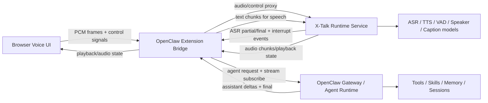
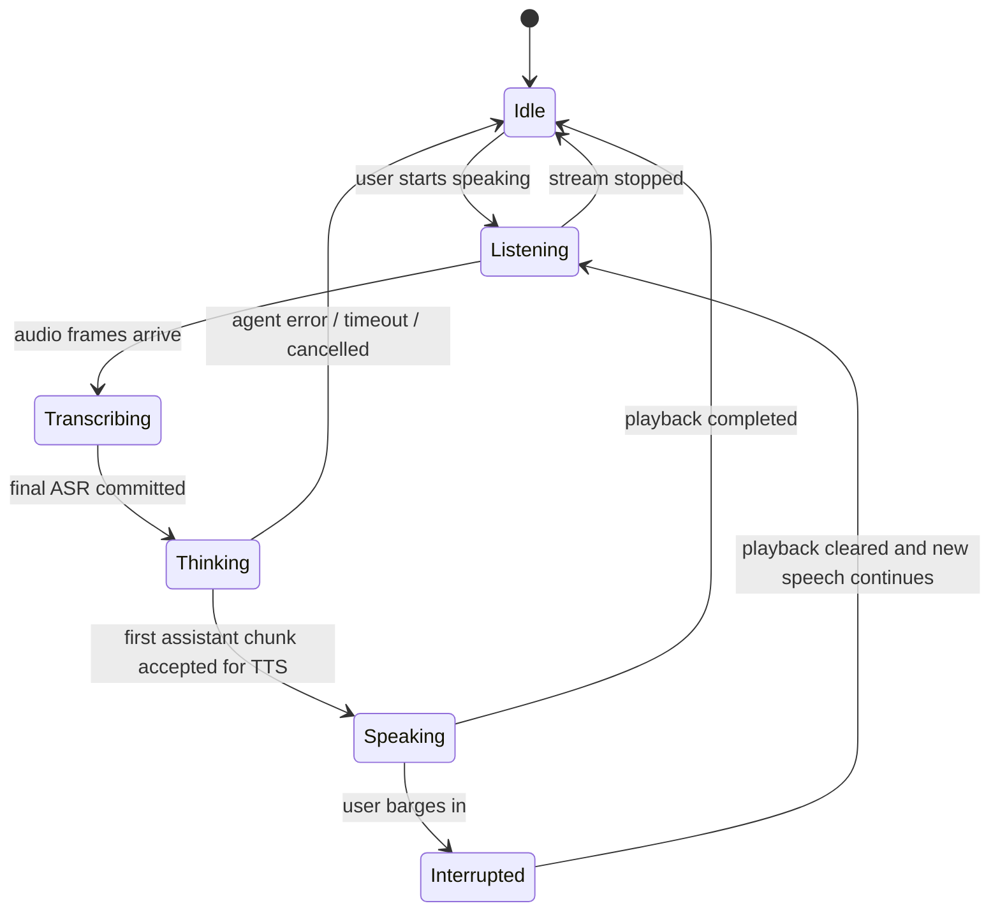
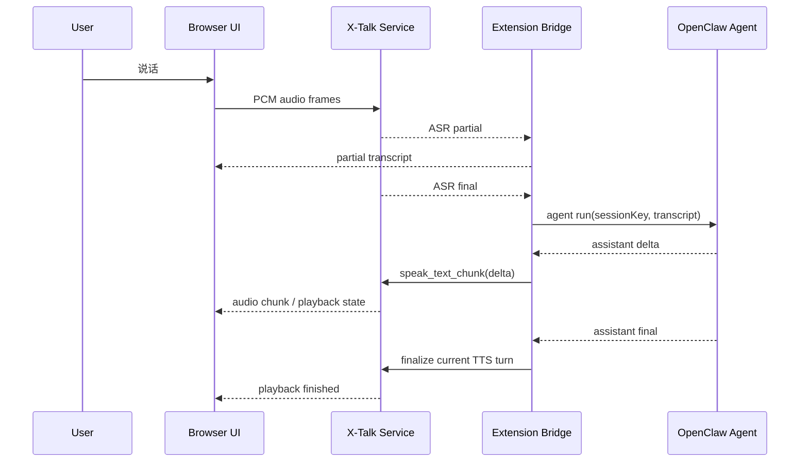
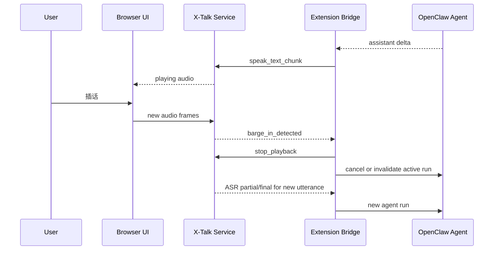

# OpenClaw x X-Talk 第一阶段设计框架

## 1. 目标定义

第一阶段的目标不是把 X-Talk 完整嵌入 OpenClaw 的所有语音链路，而是构建一个可运行、可演进、可验证的桥接型方案：

- 以 OpenClaw 为主系统，继续承载 agent、tools、skills、memory、session。
- 以 X-Talk 为语音交互引擎，负责低延迟语音输入、流式 ASR、打断检测、语音播放控制。
- 以浏览器为最小验证入口。
- 以 OpenClaw extension 为正式集成宿主。

第一阶段验收标准：

- 用户可以在浏览器中持续说话。
- 音频可以进入 X-Talk 并得到流式转写。
- 转写文本能被送入 OpenClaw 的主会话。
- OpenClaw 的回复可以被逐步送回语音层并播报。
- 用户插话时，当前播报可被中断。
- 同一个会话可以稳定进行多轮对话。

## 2. 非目标

第一阶段不处理以下事项：

- 不直接替换 OpenClaw 原生 Talk Mode 的全部内部实现。
- 不直接实现电话、Twilio、SIP、Telnyx 等语音通话接入。
- 不一开始就实现 OpenClaw 的 Realtime Voice Provider 正式能力插件。
- 不做移动端节点集成。
- 不做多租户和复杂权限控制。

## 3. 设计原则

### 3.1 单脑原则

OpenClaw 是唯一的 agent 和 session authority。

含义：

- 由 OpenClaw 决定回复内容。
- 由 OpenClaw 管理主会话历史。
- 由 OpenClaw 执行 tools、skills、memory、sandbox。
- X-Talk 不维护独立业务记忆，只维护语音流处理状态。

### 3.2 语音侧车原则

X-Talk 作为语音侧车存在，不直接接管 OpenClaw Gateway 核心协议。

含义：

- 不让 X-Talk 直接成为 OpenClaw Gateway client 替代品。
- 通过桥接层做协议和状态适配。
- 降低对 OpenClaw 主代码的侵入。

### 3.3 先文本闭环，再做深度实时化

先打通：

语音输入 -> 流式转写 -> OpenClaw agent -> 流式回复 -> TTS 播报

再逐步增强：

- 更细粒度打断
- 更细粒度流式播报
- 更低延迟
- 更强的会话取消语义

## 4. 第一阶段推荐总体架构



### 4.1 核心判断

第一阶段推荐做成三层：

- 浏览器层：负责麦克风、音频播放、可视化、基础交互。
- Extension 桥接层：负责会话编排、消息转换、OpenClaw 集成、状态机。
- X-Talk 语音层：负责语音全双工能力。

## 5. 逻辑组件划分

### 5.1 Browser Voice UI

职责：

- 采集麦克风音频。
- 显示会话状态：listening、thinking、speaking、interrupted。
- 接收音频播放流或播放指令。
- 提供开始、停止、静音、重置会话等交互。

建议实现：

- 一个最小页面，后续可嵌入 WebChat 风格界面。
- 音频格式初期使用 PCM 16-bit mono 16kHz 上行。
- 下行可先走浏览器可播放音频片段，后续再优化成更低延迟 chunk playback。

### 5.2 OpenClaw Extension Bridge

职责：

- 作为 OpenClaw extension 注册。
- 启动和管理桥接服务生命周期。
- 管理 Browser Session、X-Talk Session、OpenClaw Session 的映射关系。
- 接收 X-Talk 的 partial/final ASR 结果。
- 触发 OpenClaw agent run，并消费流式回复。
- 将回复切分后送回 X-Talk 做 TTS。
- 处理打断、取消、过期回复丢弃。

建议内部模块：

- `session-registry`
- `xtalk-adapter`
- `openclaw-agent-adapter`
- `turn-orchestrator`
- `interrupt-controller`
- `audio-playback-coordinator`
- `web-ui-route`

### 5.3 X-Talk Runtime Service

职责：

- 接收浏览器音频流。
- 执行 VAD、ASR、语音增强、可选 speaker/caption。
- 输出 partial ASR 和 final ASR。
- 在播放阶段检测用户插话。
- 接收文本块并进行 TTS。
- 向浏览器或桥接层返回播放音频和播放状态。

建议部署形态：

- 以 Python sidecar service 运行。
- 初期独立进程，由 extension 启动和守护。
- 后续视稳定性再考虑容器化或远程化。

### 5.4 OpenClaw Agent Runtime

职责：

- 处理 session 级 agent run。
- 维持会话历史、memory、skills、tools。
- 输出 assistant delta、tool event、assistant final。

第一阶段接入方式：

- 优先复用 OpenClaw 现有 agent stream 能力。
- 不改动 OpenClaw 主 session 模型。
- 仅在 extension 内订阅和转发 agent 输出。

## 6. 推荐代码结构

第一阶段推荐分成两个代码仓内模块或两个子项目：

```text
openclaw-extension-xtalk/
  src/
    index.ts
    bridge/
      session-registry.ts
      turn-orchestrator.ts
      interrupt-controller.ts
      chunking-policy.ts
    adapters/
      xtalk-adapter.ts
      openclaw-agent-adapter.ts
    web/
      routes.ts
      ui/
    types/
      protocol.ts
      state.ts
  package.json

xtalk-bridge-service/
  app.py
  websocket_server.py
  xtalk_runtime.py
  models/
  config/
  requirements.txt
```

如果希望更快验证，也可以先把浏览器页面放在 Python 侧服务中，extension 仅负责与 OpenClaw 对接。等第一阶段跑通后，再把 UI 收拢进 extension 的 Web surface。

## 7. 会话模型设计

### 7.1 三类会话 ID

第一阶段需要显式区分三类 ID：

- `browserSessionId`：浏览器页面连接标识。
- `xtalkSessionId`：X-Talk 内部语音会话标识。
- `openclawSessionKey`：OpenClaw 主会话标识，建议固定映射到 `main` 或专门的 voice session。

推荐映射：

```text
browserSessionId 1 : 1 xtalkSessionId
browserSessionId N : 1 openclawSessionKey
```

即：

- 浏览器与 X-Talk 一一对应。
- 浏览器与 OpenClaw 会话保持稳定绑定。
- 不让每次说话都创建一个新的 OpenClaw session。

### 7.2 会话上下文归属

OpenClaw 维护：

- 会话历史
- memory
- skills
- tools
- agent state

X-Talk 维护：

- 当前音频流状态
- 当前播放状态
- 当前 ASR 缓冲状态
- 当前 turn 的语音控制状态

## 8. Turn 状态机



### 8.1 状态说明

- `Idle`：空闲。
- `Listening`：正在监听用户。
- `Transcribing`：已经有语音帧输入，X-Talk 正在输出 partial ASR。
- `Thinking`：已提交 final ASR 给 OpenClaw，等待 agent 输出。
- `Speaking`：OpenClaw 回复已开始被送入 TTS 并播放。
- `Interrupted`：播放过程中检测到用户插话，当前播报被中断。

## 9. 端到端数据流

### 9.1 主成功路径



### 9.2 打断路径



## 10. 桥接协议设计

第一阶段建议桥接协议不要直接复用 OpenClaw Gateway WS 协议，也不要直接暴露 X-Talk 原始内部事件给浏览器。应该定义一个较薄的桥接协议，供 Browser UI 和 Extension Bridge 使用。

### 10.1 Browser -> Extension 消息

文本控制消息：

```json
{ "type": "session.init", "browserSessionId": "b-123" }
{ "type": "audio.start" }
{ "type": "audio.stop" }
{ "type": "audio.mute", "muted": true }
{ "type": "conversation.reset" }
{ "type": "playback.stop" }
```

二进制消息：

- 原始 PCM 音频帧。

### 10.2 Extension -> Browser 消息

```json
{ "type": "session.ready", "xtalkSessionId": "x-1", "openclawSessionKey": "main" }
{ "type": "asr.partial", "text": "你好，我想" }
{ "type": "asr.final", "text": "你好，我想问今天的天气" }
{ "type": "assistant.delta", "text": "今天" }
{ "type": "assistant.final", "text": "今天天气晴，最高温 25 度。" }
{ "type": "playback.state", "state": "speaking" }
{ "type": "interrupt.detected" }
{ "type": "error", "code": "AGENT_TIMEOUT", "message": "agent timed out" }
```

音频数据：

- 可先由 X-Talk 直出浏览器可播放的音频片段。

### 10.3 Extension 内部事件

桥接层内部建议定义标准事件：

- `USER_AUDIO_STARTED`
- `ASR_PARTIAL`
- `ASR_FINAL`
- `AGENT_RUN_STARTED`
- `AGENT_DELTA`
- `AGENT_FINAL`
- `TTS_PLAYBACK_STARTED`
- `BARGE_IN_DETECTED`
- `RUN_CANCELLED`
- `TURN_COMPLETED`

## 11. 文本分块与 TTS 策略

第一阶段不要直接按 token 级别送 TTS，建议使用句级或短块级策略。

推荐策略：

- 收到 OpenClaw assistant delta 后先做缓冲。
- 命中句号、问号、感叹号、长停顿时切块。
- 每块达到最小长度阈值后送给 X-Talk。
- 如果块过短，则继续缓冲，避免过碎播报。

建议阈值：

- 最小 12 到 20 个字符。
- 最大 80 到 120 个字符。
- 遇到明确句边界立即发送。

这样可以在延迟和自然度之间取得平衡。

## 12. 打断与取消语义

这是第一阶段成败关键。

### 12.1 打断触发源

打断可由两类信号触发：

- X-Talk 在播放期检测到用户重新发声。
- 浏览器显式点击停止说话或重新开始。

### 12.2 打断处理策略

收到打断后按顺序执行：

1. 标记当前 turn 为 `interrupted`。
2. 立即通知 X-Talk 停止播放。
3. 停止向 X-Talk 继续发送剩余文本块。
4. 取消当前 OpenClaw run，或者至少将其标记为过期。
5. 新语音一旦形成 final ASR，立刻启动新 turn。

### 12.3 过期回复保护

即使 OpenClaw 的旧 run 不能及时真正取消，也必须在桥接层做保护：

- 每个 turn 分配 `turnId`。
- 所有 agent delta 和 TTS 请求都带 `turnId`。
- 如果事件所属 `turnId` 不是当前活动 turn，直接丢弃。

## 13. 错误处理设计

### 13.1 错误分类

- `XTalkUnavailable`
- `XTalkASRFailed`
- `OpenClawAgentTimeout`
- `OpenClawAgentDisconnected`
- `TTSFailed`
- `PlaybackFailed`
- `SessionMappingLost`

### 13.2 降级策略

建议降级顺序：

1. X-Talk TTS 失败时，保留文本显示，不阻断对话。
2. 流式回复失败时，退化为只播报 final 文本。
3. 打断取消失败时，使用 `turnId` 过期机制保护输出。
4. X-Talk 不可用时，extension 返回纯文本对话模式。

## 14. OpenClaw Extension 侧设计

### 14.1 推荐 extension 能力

第一阶段建议 extension 至少具备以下能力：

- 注册一个后台服务。
- 提供一个浏览器可访问的 UI 路由或开发页。
- 提供与 OpenClaw agent runtime 的内部适配器。
- 管理 sidecar 进程生命周期。
- 记录诊断日志和时延指标。

### 14.2 推荐 OpenClaw 接入点

优先级建议：

1. `registerService`
   用于启动桥接后台服务。
2. `registerHttpRoute`
   用于暴露 UI 页面或调试端点。
3. agent stream 订阅或内部 runtime 适配
   用于消费 OpenClaw assistant delta/final。
4. 可选 hooks
   用于标记 voice-originated turn 或做调试埋点。

第一阶段不建议优先使用：

- `registerRealtimeVoiceProvider`
- `registerRealtimeTranscriptionProvider`

这两个能力更适合第二阶段做正式语音能力插件化。

## 15. X-Talk Sidecar 侧设计

### 15.1 推荐 API

建议 sidecar 暴露一个桥接 WebSocket：

- 上行：音频帧、控制消息、文本播报请求
- 下行：partial ASR、final ASR、打断事件、播放状态、可选音频块

建议消息：

```json
{ "type": "session.open", "sessionId": "x-1" }
{ "type": "audio.frame", "seq": 1 }
{ "type": "tts.enqueue", "turnId": "t-2", "text": "今天天气不错。" }
{ "type": "tts.flush", "turnId": "t-2" }
{ "type": "playback.stop", "turnId": "t-2" }
```

返回：

```json
{ "type": "asr.partial", "turnId": "t-2", "text": "今天天" }
{ "type": "asr.final", "turnId": "t-2", "text": "今天天气怎么样" }
{ "type": "barge_in", "turnId": "t-2" }
{ "type": "playback.started", "turnId": "t-2" }
{ "type": "playback.finished", "turnId": "t-2" }
```

### 15.2 X-Talk 内部集成方式

第一阶段建议不要重写 X-Talk 主架构，而是复用它已有的：

- WebSocket audio input
- Output gateway
- partial/final ASR
- TTS manager
- interruption detection

必要时只新增一层轻量包装服务，把 X-Talk 原始事件映射成桥接协议。

## 16. 可观测性设计

第一阶段就应加上关键观测指标。

### 16.1 时延指标

- `vad_to_asr_partial_ms`
- `vad_end_to_asr_final_ms`
- `asr_final_to_agent_first_delta_ms`
- `agent_first_delta_to_tts_first_audio_ms`
- `end_to_end_first_audio_ms`
- `barge_in_stop_latency_ms`

### 16.2 业务计数

- `turn_started`
- `turn_completed`
- `turn_interrupted`
- `agent_cancelled`
- `tts_failed`
- `xtalk_disconnects`

## 17. 安全与边界

### 17.1 第一阶段安全假设

- 单用户本地环境。
- 浏览器页面仅在本地访问。
- sidecar 只监听 loopback。
- 不对公网暴露语音桥接端口。

### 17.2 需要提前锁定的边界

- sidecar 服务默认仅绑定 `127.0.0.1`。
- 所有会话都必须带显式 session id。
- Browser 端不能直接访问 OpenClaw 内部敏感接口。
- 后续若支持远程访问，需要补鉴权与会话绑定。

## 18. 分阶段实施计划

### Phase 1A: 最小文本闭环

目标：

- 浏览器收音
- X-Talk 输出 final ASR
- OpenClaw 生成 final reply
- X-Talk 播报 final reply

暂不做：

- partial TTS
- 严格打断取消

### Phase 1B: 增量流式回复

目标：

- 订阅 OpenClaw assistant delta
- 句级切块送 TTS
- 播放更早开始

### Phase 1C: 打断闭环

目标：

- X-Talk 检测插话
- 立即停播
- 旧 turn 过期保护
- 新 turn 重启

### Phase 1D: 稳定性与可观测性

目标：

- 指标
- 日志
- 异常恢复
- sidecar 重连

## 19. 第二阶段演进方向

第一阶段完成后，有两条自然演进路径：

### 路线 A: 深化为 OpenClaw 正式浏览器语音能力

- 继续保留 extension + browser 入口
- 更深集成 WebChat
- 更统一的 UI 和权限模型

### 路线 B: 抽象成正式 provider

- 将 X-Talk 抽象为 `RealtimeTranscriptionProvider` 或 `RealtimeVoiceProvider`
- 服务 voice-call 或 Talk Mode 等更正式的语音能力面

路线 A 风险更低，路线 B 复用面更强。

## 20. 最终建议

第一阶段的最佳定义是：

> 一个 OpenClaw extension 承载的桥接式浏览器语音 POC，
> 其中 OpenClaw 负责 agent，X-Talk 负责全双工语音。

这一定义的好处是：

- 架构边界清晰。
- 开发顺序自然。
- 风险集中在桥接层，可控。
- 未来既能向 WebChat 深度集成，也能向 Realtime Voice Provider 演进。

## 21. 建议的首批开发任务

1. 搭一个 extension 后台服务骨架。
2. 启动并管理 X-Talk sidecar 进程。
3. 定义 Browser <-> Extension <-> X-Talk 三方桥接协议。
4. 打通 final ASR -> OpenClaw final reply -> TTS 播报。
5. 加入 turnId 和 runId，做过期回复保护。
6. 做句级文本切块与早播报。
7. 做 barge-in 停播和新 turn 重启。
8. 补日志、指标、异常恢复。