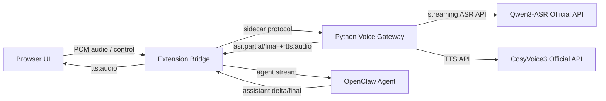

# Qwen3-ASR + CosyVoice3 官方 API 接入设计

## 1. 目标

将当前项目中本地模型推理链路替换为云端官方 API：

- ASR 使用 Qwen3-ASR 官方 API。
- TTS 使用 CosyVoice3 官方 API。
- 保持现有浏览器、Extension、OpenClaw agent、网页播放器的主流程不变。
- 尽量保留当前协议：
  - `asr.partial`
  - `asr.final`
  - `tts.enqueue`
  - `tts.flush`
  - `playback.started`
  - `playback.finished`

## 2. 当前系统边界

当前链路分成三层：

1. 浏览器页面
2. OpenClaw Extension Bridge
3. Python sidecar `xtalk-bridge-service`

其中：

- 浏览器负责录音和播放。
- Extension 负责会话编排、OpenClaw agent 交互、文本 chunking。
- Python sidecar 当前负责 ASR/TTS 推理。

因此最小改造路径不是重写前端，而是把 Python sidecar 从“本地模型执行器”改成“官方 API 代理器”。

## 3. 推荐总方案

### 3.1 设计原则

- 浏览器不直接调用官方 API。
  - 原因：避免泄露 API Key。
  - 原因：保留统一协议和状态机。
- Extension 不直接调用 ASR/TTS 官方 API。
  - 原因：Extension 目前已经通过 sidecar 协议抽象了语音侧。
  - 原因：ASR 流式音频处理放在 Python 更自然。
- Python sidecar 变为语音云网关。
  - 对上保持现有 X-Talk 协议。
  - 对下对接 Qwen3-ASR 和 CosyVoice3 官方 API。

### 3.2 新架构



## 4. 模块级改造

### 4.1 保持不变的模块

- 浏览器页面播放逻辑
- Extension 的 `TurnOrchestrator`
- OpenClaw agent adapter
- 当前的 session 映射与 turn 状态机

原因：这些模块已经对 ASR/TTS 后端做了足够抽象。

### 4.2 需要重构的模块

#### Python sidecar

当前文件：

- `xtalk_runtime.py`
- `websocket_server.py`
- `config/config.py`
- `app.py`

建议改造成以下结构：

```text
xtalk-bridge-service/
  app.py
  websocket_server.py
  config/
    config.py
  providers/
    asr_base.py
    tts_base.py
    qwen3_asr_api.py
    cosyvoice3_api.py
  runtime/
    asr_session.py
    tts_queue.py
  types/
    api_models.py
```

## 5. ASR 设计

### 5.1 推荐模式

优先使用 Qwen3-ASR 官方流式接口。

目标能力：

- 音频持续上行
- 持续返回 partial transcript
- 结束时返回 final transcript
- 可选返回时间戳和 endpointing 信息

### 5.2 适配器接口

定义统一抽象：

```python
class AsrStreamSession(Protocol):
    async def start(self) -> None: ...
    async def send_audio(self, pcm_bytes: bytes) -> None: ...
    async def finish(self) -> None: ...
    async def cancel(self) -> None: ...
```

以及事件回调：

```python
@dataclass
class AsrPartialEvent:
    text: str

@dataclass
class AsrFinalEvent:
    text: str
    speech_ended_at_ms: int | None = None
    endpoint_wait_ms: int | None = None
    transcribe_duration_ms: int | None = None
```

### 5.3 Qwen3-ASR Provider 责任

`providers/qwen3_asr_api.py` 负责：

- 建立官方流式连接
- 将浏览器 16k PCM 音频转成 API 要求格式
- 将官方 partial/final 事件转换为内部事件
- 处理 reconnect / timeout / close
- 处理一轮 turn 的结束和取消

### 5.4 两种接法

#### 方案 A：官方实时流式 API

这是优先方案。

优点：

- 能保留当前 `asr.partial` 体验
- 延迟最低
- 最符合当前网页和状态机设计

要求：

- 官方 API 支持 websocket 或双向流
- 能接受分片音频

#### 方案 B：本地 VAD + 云端一次一段上传

这是降级方案。

流程：

- 本地 sidecar 继续做 VAD
- 每次语音结束后上传整段音频到官方 HTTP API
- 仅返回 final transcript

缺点：

- 丢失实时 partial
- 交互体验会明显退化

结论：

- 如果 Qwen3-ASR 官方 API 有流式模式，用方案 A。
- 如果没有，用方案 B 兜底，但前端状态要从“实时转写”降级为“段落转写”。

## 6. TTS 设计

### 6.1 推荐模式

使用 CosyVoice3 官方 API 作为 chunk-based TTS 后端。

当前 `TurnOrchestrator` 已经会把 agent 文本按句子切块后调用：

- `tts.enqueue`
- `tts.flush`

因此 TTS 最适合保持“每个文本 chunk 发起一次官方 API 请求”。

### 6.2 TTS 适配器接口

```python
class TtsProvider(Protocol):
    async def synthesize(self, text: str) -> bytes: ...
    async def cancel(self, request_id: str | None = None) -> None: ...
```

其中返回值建议统一为：

- `audio/wav` 字节串
- 或 sidecar 内部先统一转成 WAV 再回传

### 6.3 CosyVoice3 Provider 责任

`providers/cosyvoice3_api.py` 负责：

- 调用官方 TTS API
- 处理音色 / prompt / style / instruct 参数
- 将 API 返回的音频统一成浏览器可播放的格式
- 暴露稳定的 `synthesize(text) -> bytes`

### 6.4 为什么不建议浏览器直连 TTS API

- API Key 暴露风险高
- 打断控制会变复杂
- 无法与当前 `playback.stop` / `turnId` 语义对齐
- 无法统一日志与错误处理

## 7. Sidecar 内部新状态机

### 7.1 ASR Session

每个 `sessionId` + `turnId` 对应一个 Qwen3-ASR 流式会话对象：

- `start()` 在 `session.open` 时创建
- `send_audio()` 在 `audio.frame` 时持续送音频
- `finish()` 在 `audio.stop` 或检测到 endpoint 后关闭该轮 ASR
- `cancel()` 在 reset / disconnect 时调用

### 7.2 TTS Queue

每个 session 保留当前已存在的 TTS 队列语义：

- `tts.enqueue` 只入队文本
- worker 串行调 CosyVoice3 API
- 每返回一段音频就发送 `tts.audio`
- `tts.flush` 表示当前 turn 文本结束
- 队列清空后发送 `playback.finished`

### 7.3 Interrupt / Stop

`playback.stop` 的语义：

- 清空本地待播队列
- 停止后续 TTS API 请求
- 已返回浏览器但未播放的音频由浏览器丢弃
- 如果官方 API 支持取消，则同时向云端发送 cancel

## 8. 配置设计

建议新增环境变量：

```env
# 通用
MODEL_STUDIO_API_KEY=
MODEL_STUDIO_BASE_URL=
API_TIMEOUT_MS=30000

# ASR
ASR_PROVIDER=qwen3_api
QWEN3_ASR_MODEL=
QWEN3_ASR_LANGUAGE=zh
QWEN3_ASR_STREAMING=1
QWEN3_ASR_SAMPLE_RATE=16000

# TTS
TTS_PROVIDER=cosyvoice3_api
COSYVOICE3_MODEL=
COSYVOICE3_VOICE=
COSYVOICE3_FORMAT=wav
COSYVOICE3_SAMPLE_RATE=24000
COSYVOICE3_PROMPT_TEXT=
COSYVOICE3_PROMPT_AUDIO_PATH=
COSYVOICE3_INSTRUCT_TEXT=
```

原则：

- provider 名和 model 名分开
- 不在代码里写死 endpoint
- 不在浏览器层暴露任何 API Key

## 9. 对现有代码的具体改造建议

### 9.1 `app.py`

当前：

- 启动时直接加载 `WhisperModel`
- 构造 `CosyVoiceTTS`

建议：

- 改为构造 `Qwen3AsrProviderFactory`
- 改为构造 `CosyVoice3ApiProvider`
- sidecar 启动时不再加载大模型权重

收益：

- 启动更快
- 内存压力更小
- 更适合部署到轻量节点

### 9.2 `websocket_server.py`

当前：

- `WhisperASR.feed()` 驱动 partial/final
- `tts.synthesize()` 本地生成 WAV

建议：

- `session.open` 时创建 `asr_stream`
- `audio.frame` 直接转发给 `asr_stream.send_audio()`
- 将 provider 事件映射为 `asr.partial` / `asr.final`
- 保留现有 `tts_queue`，但 worker 中调用云端 TTS

### 9.3 `xtalk_runtime.py`

建议拆分：

- `WhisperASR` 从主路径删除
- `CosyVoiceTTS` 从主路径删除
- 保留通用数据类型与工具函数

### 9.4 `TurnOrchestrator`

建议保持不动。

原因：

- 它只依赖文本与 TTS chunk 语义
- 与具体云端还是本地推理无关

## 10. 错误处理设计

### 10.1 ASR 错误

侧车应统一转成：

- `XTALK_ASR_FAILED`
- 附带 provider 原始错误码和 message

策略：

- 当前轮失败
- 不污染 OpenClaw session 历史
- UI 回到 `idle`

### 10.2 TTS 错误

侧车应统一转成：

- `TTS_FAILED`

策略：

- 允许文本回复继续显示
- 仅语音播报失败
- 不影响下一轮 ASR

### 10.3 Provider 限流

要单独处理：

- 429
- 鉴权失败
- 音频格式错误
- 超时

建议日志维度：

- provider
- sessionId
- turnId
- requestId
- latencyMs

## 11. 可观测性设计

当前已有 Debug Timeline，建议保留并扩展以下指标：

- `asrUploadStartedAt`
- `asrFirstTokenAt`
- `asrFinalAt`
- `ttsRequestStartedAt`
- `ttsFirstAudioAt`
- `ttsLastAudioAt`
- `providerRoundTripMs`

这样可以区分：

- 浏览器采集延迟
- 云端 ASR 延迟
- OpenClaw agent 延迟
- 云端 TTS 延迟
- 浏览器播放延迟

## 12. 推荐实施顺序

### 阶段 1：TTS 云化

先把 TTS 换成 CosyVoice3 官方 API。

原因：

- 当前 TTS 已经是 chunk 队列模型
- 接口最容易替换
- 风险比 ASR 小

验收标准：

- `tts.enqueue` / `tts.flush` 不变
- 浏览器能正常播报官方 API 返回音频

### 阶段 2：ASR 云化

再把 ASR 换成 Qwen3-ASR 官方 API。

优先实现：

- 流式 partial
- final
- 断线重连

### 阶段 3：去除本地模型依赖

删除：

- `faster-whisper`
- 本地 CosyVoice 运行时依赖
- 相关 shim 和 bootstrap 脚本

## 13. 关键风险

### 风险 1：Qwen3-ASR 官方 API 若不支持 partial

影响：

- 当前实时转写体验无法完全保留

应对：

- 保留本地 VAD
- 降级为段落级 final transcript

### 风险 2：CosyVoice3 官方 API 音频格式与当前播放链不一致

影响：

- 浏览器无法直接播放

应对：

- sidecar 统一转成 WAV 再下发

### 风险 3：云端 API 延迟高于本地模型

影响：

- Debug Timeline 指标变差

应对：

- 保持文本先显示
- TTS 继续走句级 chunking
- 做 provider 级 timeout / retry / fallback

## 14. 最终建议

推荐最终落地路线：

1. 保持浏览器和 Extension 不动。
2. 将 Python sidecar 重构为官方 API 语音代理层。
3. TTS 先切 CosyVoice3 官方 API。
4. ASR 再切 Qwen3-ASR 官方流式 API。
5. 只有在确认官方 API 不支持实时 partial 时，才降级为本地 VAD + 云端 final 转写。

## 15. 当前设计结论

对于你的这个项目，最佳设计不是：

- 浏览器直连官方 API
- Extension 直接请求官方 API

而是：

- **保留现有 sidecar 协议与网页状态机**
- **把 sidecar 内部的本地 ASR/TTS 执行器替换成官方 API adapter**

这样改动最小，回归风险最低，也最符合当前代码结构。